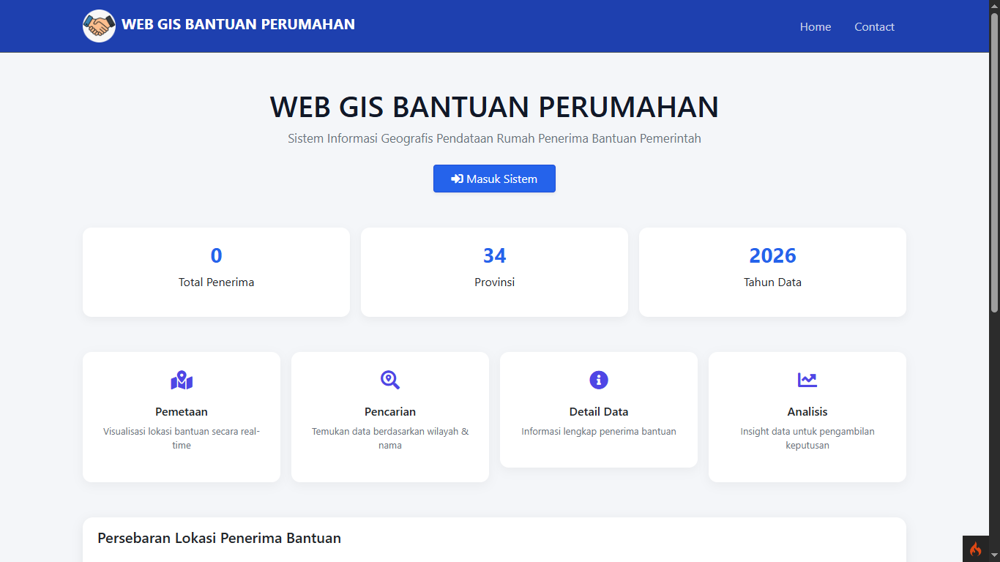
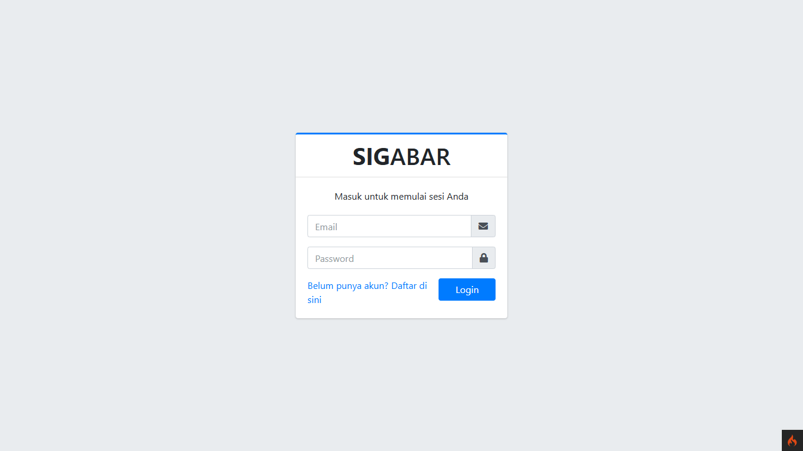
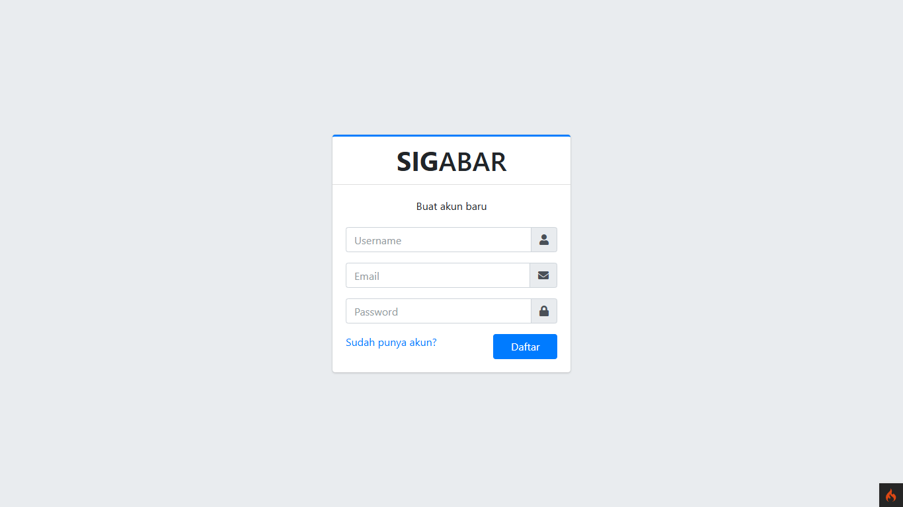
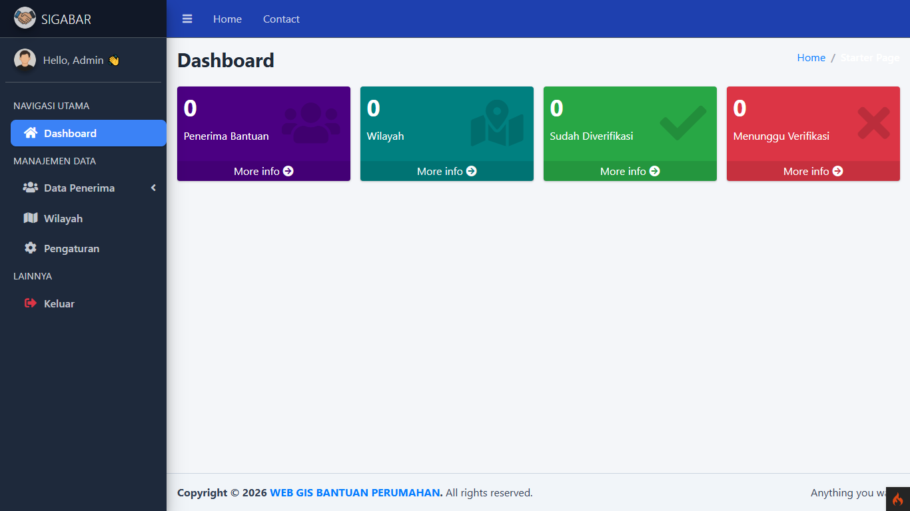

# WebGIS Pemetaan Perumahan - CodeIgniter 4

<p>
  
  
  
  
  
  
</p>

Sistem Informasi Geografis (GIS) berbasis web untuk mendata dan memvisualisasikan lokasi perumahan yang menerima bantuan dari pemerintah. Aplikasi ini dibangun menggunakan framework **CodeIgniter 4** dan library **Leaflet.js** untuk menampilkan peta interaktif.

---

## 🛠️ Fitur Utama

- ✅ Autentikasi (Login & Register)
- ✅ Manajemen Data Penerima Bantuan
  - Tambah, Edit, Hapus Data
  - Upload Foto dan Dokumen
- ✅ Visualisasi Lokasi di Peta (Leaflet)
- ✅ Validasi Form dan Upload
- ✅ Admin Dashboard (dengan AdminLTE)

---

## 🗂️ Struktur Proyek

```
/app
  ├── Controllers
  ├── Models
  ├── Views
  └── Config
/public
  └── AdminLTE/
/writable
.env
```

---

## ⚙️ Instalasi & Menjalankan

1. **Clone repository:**

```bash
git clone https://github.com/pangeran-droid/WebGIS-Perumahan-CI4.git
cd WebGIS-Perumahan-CI4
```

2. **Install dependency:**

```bash
composer install
```

3. **Copy konfigurasi env:**

```bash
cp .env.example .env
```

4. **Edit .env untuk sesuaikan database:**

```bash
database.default.hostname = localhost
database.default.database = nama_database
database.default.username = root
database.default.password =
database.default.DBDriver = MySQLi
```

5. **Import SQL ke database:**

```bash
Import file database/db_gis_perumahan.sql ke phpMyAdmin atau MySQL CLI.
```

6. **Jalankan server:**

```bash
php spark serve

Akses di browser: http://localhost:8080
```

## 🗺️ Peta & Koordinat

Peta menggunakan Leaflet.js, dan input koordinat didapat melalui klik langsung pada peta saat input/edit data.

## 📦 Teknologi yang Digunakan

- CodeIgniter 4 (PHP Framework)

- Leaflet.js (Peta Interaktif)

- MySQL (Database)

- AdminLTE (Tampilan dashboard)

- JavaScript & Bootstrap 4

## 👁️ Pratinjau

| Home | Login |
|---|---|
|  |  |

| Register | Dashboard |
|---|---|
|  |  |

## 📄 Lisensi

Proyek ini bebas digunakan untuk pembelajaran. Silakan modifikasi sesuai kebutuhan. Attribution appreciated.
